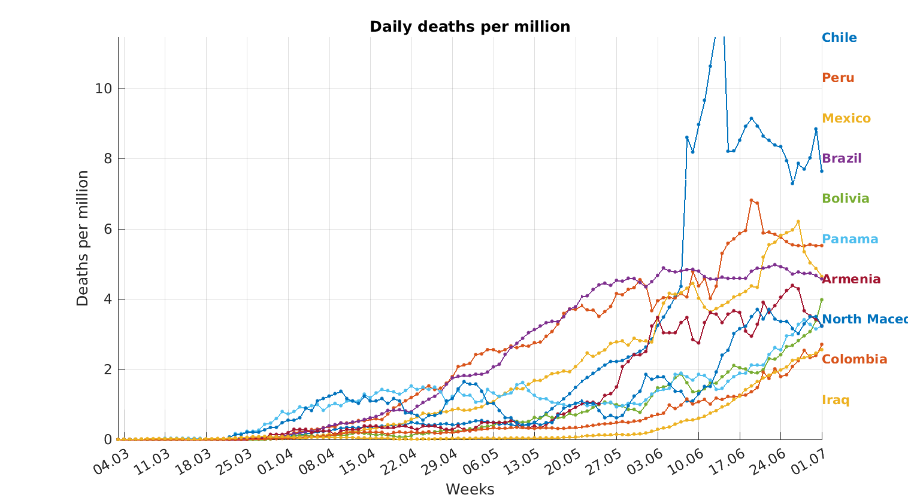

# COVID-19 data analysis
### Automatically generated charts showing daily updates of COVID-19 deaths
This is an open-source project using Matlab tools to generate images from online available data. It is mainly concerned with death rates, because it is hard to compare countries for any other measurement. The number of confirmed cases for instance, is biased by the number of tests run by different countries.
 
### Most affected regions
Regions with the heaviest death toll per million people 
We want to know at what death rate the population is saturated, and the virus stops sprreading. San Marino seem to be stabilizing at 1200 deaths per million, although in NYC are twice as high. 
*New York City (NYC) publishes probable COVID-19 deaths in addition to confirmed deaths.

### Most active countries
Countries with the heaviest *daily* death toll per million people

### More plots
For the 10 most affected countries by different criteria click [here](highest_countries.html) 
Realigned curves for top 20 countries [here](realigned.html) 
To compare Israel to other countries [here](myCountry.html) 
Stay safe     
### Last updated for 17.05.2020
### Acknowledgements
The COVID-19 data is taken from the John Hopkins COVID-19 database. The data can be found [here](https://github.com/CSSEGISandData/COVID-19). 
Adapted from [aahr](https://github.com/aahr/covid-19_data_analysis)

